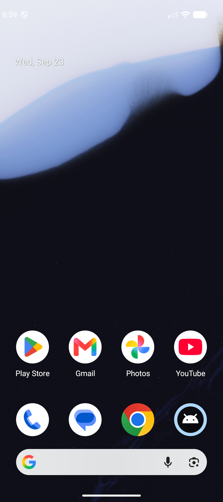
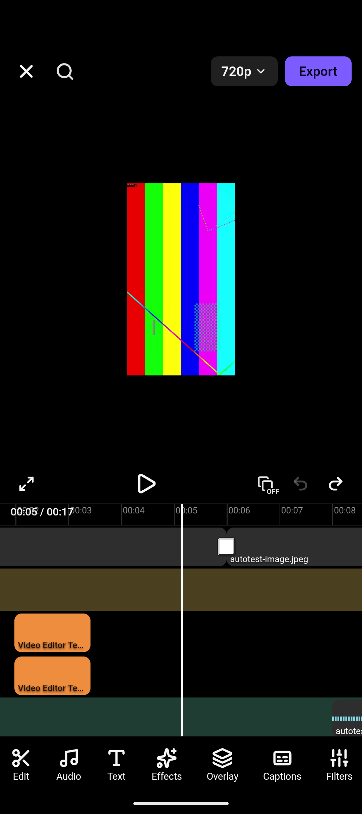

# Cutlyra

**Create. Cut. Tell your story.**

Cutlyra is a free, open-source, local-first mobile video editor. No account,
no subscription, no watermark, no ads, no telemetry, and no cloud
requirement — editing and export run entirely on your device.

Cutlyra is an **independent project**. It is **not affiliated with, endorsed
by, or sponsored by** OpenCut, OpenCut-app, CapCut, ByteDance, or TikTok
Pte. Ltd. No CapCut trademarks, marks, or copyrighted assets are bundled,
redistributed, or reproduced here.

## Based on OpenCut-app/opencut-classic (MIT)

The editing engine at the heart of Cutlyra is forked from
[**`OpenCut-app/opencut-classic`**](https://github.com/OpenCut-app/opencut-classic)
— the archived Next.js/Rust engine behind the original OpenCut web editor —
licensed under the **MIT License**. The original copyright notice and
license are preserved verbatim in `LICENSE`; see `NOTICE` for the
attribution statement and `docs/THIRD_PARTY_NOTICES.md` for the full
inventory of bundled third-party assets and dependency licenses.
The internal engine packages keep the historical `@cutlyra` workspace scope
introduced during the fork; upstream import paths were renamed as part of
the fork's rebrand.

## What this is

Cutlyra is a touch-first mobile editor for Android, running fully on-device:

- **Zero cloud dependency.** No account, no server, no paid API of any
  kind. The app is designed to work correctly with the network off.
- **On-device auto-captions** (whisper.cpp running locally on Android),
  multi-track timeline editing, trim/split/duplicate, transitions, text and
  stickers, picture-in-picture overlay media, filters, adjust controls
  (brightness/contrast/saturation), aspect-ratio canvas control, clip
  speed, transform/opacity keyframes, undo/redo, and hardware-accelerated
  MP4 export — all local.
- **Android distribution.** Direct signed APK releases remain supported, and
  Google Play preparation is tracked in `docs/PLAY_STORE_RELEASE.md`.
  Play uses an AAB + Play App Signing; sideload guides remain available.

## Current status (v0.1.0)

Android is the shipping target for v0.1.0. The architecture:

- `apps/mobile/` — **the app.** Capacitor 8 shell (Kotlin/Android +
  Swift/iOS) loading a React/Vite bundle built from `@cutlyra/mobile-ui`.
- `packages/editor-core/` — the headless editing engine. Framework-
  agnostic TypeScript: no React, no DOM assumptions, no server. Its
  `react/` subdirectory holds the one React-aware file. Frozen **EDL v1**
  is the native-export bridge contract (`docs/EDL.md`).
- `packages/mobile-ui/` — the mobile editor UI kit: dark editing
  workspace, multi-track timeline, tool rail, preview with direct
  manipulation.
- `packages/native-bridge/` — the single TypeScript seam between the app
  and the native shells (media custody/import, proxy transcode, export,
  speech-to-text) with a web-fallback implementation.
- `apps/mobile/android/` — the Android implementation: Kotlin
  `NativeBridgePlugin` (Photo Picker / SAF import, Media3 proxy transcode,
  Media3 Transformer export with a custom cross-fade compositor,
  keyframe-aware export, whisper.cpp JNI captions), arm64-v8a.
- `apps/mobile/ios/` — the iOS shell (kept working; not the v0.1.0
  priority).
- `rust/` — the Rust/wgpu compositor compiled to WASM (preview effects
  pipeline) and its supporting crates.
- `apps/web/` — the inherited Next.js web app, kept as the engine's dev
  harness.
- `scripts/` — `offline-audit.{sh,mjs}` (the CI gate that keeps the app
  network-free), `invariants.sh` (the merge gate), `check-headless.mjs`
  (the `packages/editor-core` import gate), and
  `generate-third-party-notices.mjs`.

## Supported Android versions

Android 10 (API 29) or newer, arm64-v8a devices. The v0.1.0 QA build is
targeted at modern ARM64 hardware (Snapdragon-class devices on recent
Android releases).

## Screenshots

Captured from the v0.1.0 QA build running on the Android emulator (1080×2424):



*Projects home — local projects live entirely on-device.*



*Editor — multi-track timeline with an imported clip; the toolbar runs
import, playback, undo/redo, and export.*

## Building locally

Prerequisites: [Bun](https://bun.sh/docs/installation) (see
`packageManager` in `package.json`), JDK 21, the Android SDK (platform 36,
build-tools 36.0.0), and — for on-device captions — the Android NDK +
CMake.

```bash
bun install

# build the app bundle and sync it into the native shells
cd apps/mobile
bun run build
bunx cap sync android

# Android debug APK
cd android
./gradlew assembleDebug
# -> app/build/outputs/apk/debug/app-debug.apk
```

On-device captions need two build-time fetches (both gitignored, never
committed):

```bash
cd apps/mobile
bash scripts/fetch-whisper-cpp.sh            # whisper.cpp sources (MIT)
bash scripts/download-whisper-model.sh tiny.en --platform android
```

Without them the app still builds and runs; generating captions then fails
with a clear error naming the missing pieces instead of pretending to work.

## Installing the APK

Sideloading (Android 10+):

1. Copy the APK to the device and open it, or `adb install
   Cutlyra-v0.1.0-debug.apk`.
2. Android will ask to allow installs from that source once — confirm.
3. Launch **Cutlyra**.

Debug-signed APKs install directly. Release APKs are signed with the
maintainer's keystore (see `docs/RELEASING.md`); never install a release
APK from an untrusted source.

## Privacy / local-first design

- No account, no sign-in, no subscription, no ads, no watermark.
- No telemetry, no analytics, no crash reporting.
- No required internet connection for editing or export.
- User videos/photos/audio are never uploaded anywhere: imports are copied
  into the app's private storage on the device, and every processing step
  (proxy transcode, captions, export) runs on-device.
- `scripts/offline-audit.sh` (run in CI on every push) enforces that the
  app contains no outbound network paths beyond a documented allowlist of
  plain credit links.

## Contributing

1. Fork, branch, make your change.
2. Run the merge gate locally: `bash scripts/invariants.sh` (build,
   typecheck, lint, unit tests, offline audit, architecture gates).
3. Open a pull request with a short description of what changed and what
   you ran. Tests for bug fixes are expected, same as the main repo's
   practice.
4. For security issues, see `SECURITY.md`.

## License

[MIT](LICENSE) — see `NOTICE` for the required upstream attribution and
`docs/THIRD_PARTY_NOTICES.md` for third-party asset and dependency
licenses.
